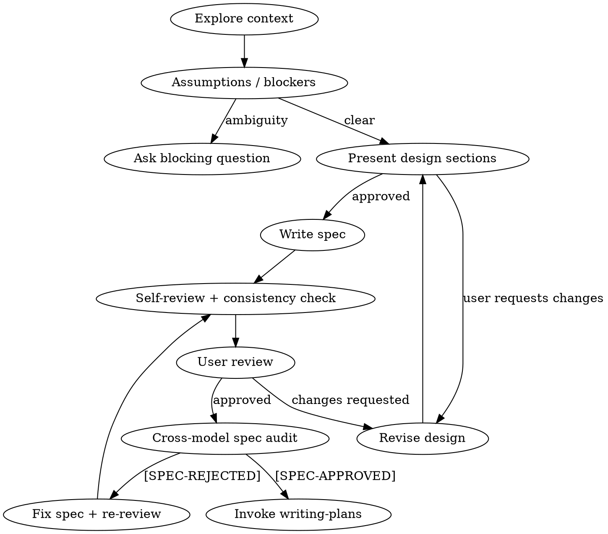

# Resistance Engine Authoring Scaffolding Restoration Implementation Plan

> **For agentic workers:** REQUIRED SUB-SKILL: Use resistance-engine:subagent-driven-development (recommended) or resistance-engine:executing-plans to implement this plan task-by-task. Steps use checkbox (`- [ ]`) syntax for tracking.

**Goal:** Restore the missing operator-facing workflow shell in `brainstorming` and the missing executor-facing plan scaffold in `writing-plans` without weakening the current self-sufficient hardening.

**Architecture:** Keep the current worktree skills as the safety core and layer vendor-style workflow scaffolding back on top. Implement the repair in two sequential tasks: first restore `brainstorming` as a guided state machine, then restore `writing-plans` as an executor-ready scaffold, preserving the existing acceptance contract, fail-closed overlay rules, and generated catalog/provenance outputs.

**Tech Stack:** Markdown skill docs, `python3` importer/validator scripts, `.venv/bin/pytest`, generated resistance-engine catalog/provenance artifacts

---

### Risk & Confidence Assessment

**Confidence:** 92% — the file surface is small and the tests already pin the core hardening phrases, but the restored headings still need additive wording-level coverage.

**Complexity Risk:** Medium — the driving variable is preserving the current safety rules while reintroducing vendor-style scaffolding without duplicating or contradicting the hard gates.

**Environmental Risk:** Low — the work is markdown-heavy and uses already verified local commands, but the importer-generated artifacts must be refreshed whenever the shipped skill text changes.

**Main failure modes:** restoring headings without explicit loopbacks, reintroducing a softer handoff that bypasses `[SPEC-APPROVED]` or Unified Coherence, forgetting to regenerate `catalog_index.json` / `provenance_manifest.json`, or adding tests that only pin headings while missing the preserved fail-closed wording.

**Unknown variables** (only when confidence < 95%):
- The existing wording-level tests may need one or two additional assertions beyond simple headings if the first RED pass still misses a real regression path.
- The best insertion point for `Execution Handoff` may need a small refactor pass so it sits after the planning gates instead of reading like an alternate route around them.

**Spec:** `docs/superpowers/specs/2026-04-16-resistance-engine-authoring-scaffolding-restoration-design.md`

---

## Scope Check

This spec intentionally spans two independent-but-related skill files. Do **not** split it into separate plan documents; the user explicitly wants one plan with two sequential tasks, and both tasks share the same acceptance surface, tests, and generated artifact refresh path.

## File Structure

| File | Responsibility in this plan |
| --- | --- |
| `resistance-engine/skills/brainstorming/SKILL.md` | Restore operator-facing workflow sections while preserving the existing adversarial and audit rules |
| `resistance-engine/skills/writing-plans/SKILL.md` | Restore executor-facing planning scaffold while preserving Tabula Rasa, risk/confidence, fail-closed planning, and Unified Coherence |
| `tests/scripts/test_import_superpowers_catalog.py` | Pin the imported live-vendor-shaped output to the restored headings and preserved hard-gate wording |
| `tests/scripts/test_validate_resistance_engine_provenance.py` | Pin the generated `resistance-engine` tree to the same restored wording contract |
| `resistance-engine/catalog/catalog_index.json` | Regenerated output after source skill text changes |
| `resistance-engine/provenance/provenance_manifest.json` | Regenerated output after source skill text changes |

## Bite-Sized Task Granularity

Each task below keeps RED, GREEN, and REFACTOR separate. No single step edits more than one core skill file plus the two shared regression tests and regenerated artifacts.

---

### Task 1: Restore `brainstorming` workflow scaffolding

**Files:**
- Modify: `resistance-engine/skills/brainstorming/SKILL.md`
- Modify: `tests/scripts/test_import_superpowers_catalog.py`
- Modify: `tests/scripts/test_validate_resistance_engine_provenance.py`
- Regenerate: `resistance-engine/catalog/catalog_index.json`
- Regenerate: `resistance-engine/provenance/provenance_manifest.json`

- [ ] **Step 1: Write the failing wording-level tests for the missing `brainstorming` workflow shell**

Add additive assertions to both regression tests so they fail until the restored
workflow sections exist **and** still point at the current hard gates.

```python
# tests/scripts/test_validate_resistance_engine_provenance.py
brainstorming_skill = (brainstorming_root / "SKILL.md").read_text()
assert "## Anti-Pattern: \"This Is Too Simple To Need A Design\"" in brainstorming_skill
assert "## Checklist" in brainstorming_skill
assert "## Process Flow" in brainstorming_skill
assert "## After the Design" in brainstorming_skill
assert "`SPEC-APPROVED` is required before plan writing" in brainstorming_skill
assert ".review_log.jsonl" in brainstorming_skill

# tests/scripts/test_import_superpowers_catalog.py
brainstorming_skill = (brainstorming_root / "SKILL.md").read_text()
assert "## Anti-Pattern: \"This Is Too Simple To Need A Design\"" in brainstorming_skill
assert "## Checklist" in brainstorming_skill
assert "## Process Flow" in brainstorming_skill
assert "## After the Design" in brainstorming_skill
assert "`SPEC-APPROVED` is required before plan writing" in brainstorming_skill
assert ".review_log.jsonl" in brainstorming_skill
```

These assertions cover two failure modes before the happy path:
1. the workflow shell is still missing
2. the restored shell exists but no longer routes through the current review/audit gates

- [ ] **Step 2: Run the focused RED tests and confirm the new assertions fail**

Run:

```bash
timeout 30 .venv/bin/pytest \
  tests/scripts/test_import_superpowers_catalog.py::test_import_superpowers_catalog_matches_live_vendor_repo_shape \
  tests/scripts/test_validate_resistance_engine_provenance.py::test_validate_provenance_requires_authoring_default_contracts \
  --override-ini="addopts=" -q
```

Expected: FAIL on the new `brainstorming` assertions because the current worktree file
does not yet contain the restored workflow headings/flow shell.

- [ ] **Step 3: Add the minimal `brainstorming` scaffolding that restores the state machine without weakening the current hardening**

Update `resistance-engine/skills/brainstorming/SKILL.md` by inserting restored vendor-role
sections that point into the existing safety core instead of replacing it.

````markdown
## Anti-Pattern: "This Is Too Simple To Need A Design"

Every request still goes through design. The difference is that this skill does not
use the anti-pattern warning to become friendlier or faster; it uses it to explain why
"obviously simple" is often where undefined privacy, auth, or dependency assumptions
hide.

## Checklist

1. Explore repository context before trusting the request.
2. Surface blocking ambiguities before drafting the spec body.
3. Interrogate assumptions before architecture.
4. Present design sections and collect user approval section-by-section.
5. Write the spec with `### Threat Model (CIA)` and `Given / When / Then` criteria.
6. Run the self-review loop, including post-fix consistency checks.
7. Record review outcomes in `.review_log.jsonl`.
8. Do not invoke `writing-plans` until `[SPEC-APPROVED]`.

## Process Flow



## After the Design

- Commit the spec before the next audit round.
- Ask the user to review the written spec.
- Record the audit result in `.review_log.jsonl`.
- Treat `[SPEC-APPROVED]` as the only valid transition into `writing-plans`.
````

- [ ] **Step 4: Refactor the restored sections so they reference, not duplicate, the existing hard rules**

Trim any duplicated bullets that restate the same rule twice and keep the restored
sections as navigational guidance only. Preserve the current `Core Premise`,
`Mandatory outputs`, `Drafting-time repository ingestion`, `Review loop discipline`,
and `Cross-model audit` sections as the authoritative rule text.

```markdown
- Keep the restored sections short and operator-facing.
- Point them at the existing hard-gate sections by name.
- Do not remove `### Threat Model (CIA)`, `.review_log.jsonl`, or `[SPEC-APPROVED]`.
```

- [ ] **Step 5: Regenerate artifacts and run the focused GREEN verification**

Run:

```bash
python3 scripts/import_superpowers_catalog.py
python3 scripts/validate_resistance_engine_provenance.py resistance-engine
timeout 30 .venv/bin/pytest \
  tests/scripts/test_import_superpowers_catalog.py::test_import_superpowers_catalog_matches_live_vendor_repo_shape \
  tests/scripts/test_validate_resistance_engine_provenance.py::test_validate_provenance_requires_authoring_default_contracts \
  --override-ini="addopts=" -q
```

Expected:
- importer completes successfully
- provenance validation passes
- both focused tests pass with the new `brainstorming` assertions

- [ ] **Step 6: Commit Task 1 as a self-contained restore**

Run:

```bash
git add \
  resistance-engine/skills/brainstorming/SKILL.md \
  tests/scripts/test_import_superpowers_catalog.py \
  tests/scripts/test_validate_resistance_engine_provenance.py \
  resistance-engine/catalog/catalog_index.json \
  resistance-engine/provenance/provenance_manifest.json
git commit -m "docs(authoring): restore brainstorming workflow shell" \
  -m "Co-authored-by: Copilot <223556219+Copilot@users.noreply.github.com>"
```

Expected: one commit contains the RED->GREEN->REFACTOR completion for the
`brainstorming` restore only.

---

### Task 2: Restore `writing-plans` executor scaffolding

**Files:**
- Modify: `resistance-engine/skills/writing-plans/SKILL.md`
- Modify: `tests/scripts/test_import_superpowers_catalog.py`
- Modify: `tests/scripts/test_validate_resistance_engine_provenance.py`
- Regenerate: `resistance-engine/catalog/catalog_index.json`
- Regenerate: `resistance-engine/provenance/provenance_manifest.json`

- [ ] **Step 1: Write the failing wording-level tests for the missing `writing-plans` scaffold**

Extend the same two regression tests so they fail until the restored planning scaffold
exists and still routes into the current fail-closed gates.

```python
# tests/scripts/test_validate_resistance_engine_provenance.py
writing_plans_skill = (writing_plans_root / "SKILL.md").read_text()
assert "## Scope Check" in writing_plans_skill
assert "## File Structure" in writing_plans_skill
assert "## Task Structure" in writing_plans_skill
assert "## No Placeholders" in writing_plans_skill
assert "## Execution Handoff" in writing_plans_skill
assert "subagent-driven-development" in writing_plans_skill
assert "executing-plans" in writing_plans_skill

# tests/scripts/test_import_superpowers_catalog.py
writing_plans_skill = (writing_plans_root / "SKILL.md").read_text()
assert "## Scope Check" in writing_plans_skill
assert "## File Structure" in writing_plans_skill
assert "## Task Structure" in writing_plans_skill
assert "## No Placeholders" in writing_plans_skill
assert "## Execution Handoff" in writing_plans_skill
assert "subagent-driven-development" in writing_plans_skill
assert "executing-plans" in writing_plans_skill
```

These assertions cover two failure modes before the happy path:
1. the executor-facing scaffold is still missing
2. the restored handoff fails to name the supported execution paths explicitly

- [ ] **Step 2: Run the focused RED tests and confirm the new assertions fail**

Run:

```bash
timeout 30 .venv/bin/pytest \
  tests/scripts/test_import_superpowers_catalog.py::test_import_superpowers_catalog_matches_live_vendor_repo_shape \
  tests/scripts/test_validate_resistance_engine_provenance.py::test_validate_provenance_requires_authoring_default_contracts \
  --override-ini="addopts=" -q
```

Expected: FAIL on the new `writing-plans` assertions because the current worktree file
does not yet contain the restored scaffold/handoff sections.

- [ ] **Step 3: Add the minimal `writing-plans` scaffolding that restores executor ergonomics without weakening the current plan gates**

Update `resistance-engine/skills/writing-plans/SKILL.md` so the restored sections wrap the
existing rulebook instead of bypassing it.

````markdown
## Scope Check

Before writing tasks, decide whether the approved spec should stay in one plan or be
split into independent plans. For this authoring restore, keep one plan with two
sequential tasks because both changes share the same acceptance surface and test files.

## File Structure

- Map exact files before task decomposition.
- Keep one core skill file per task plus the two shared regression tests.
- Regenerate `catalog_index.json` and `provenance_manifest.json` after source skill text changes.

## Task Structure

### Task 2: Restore `writing-plans` executor scaffolding

**Files:**
- Modify: `resistance-engine/skills/writing-plans/SKILL.md`
- Modify: `tests/scripts/test_import_superpowers_catalog.py`
- Modify: `tests/scripts/test_validate_resistance_engine_provenance.py`

- [ ] Step 1: write the failing wording-level assertions
- [ ] Step 2: run the focused RED test command
- [ ] Step 3: write the minimum markdown needed in the skill file
- [ ] Step 4: refactor duplicated wording without weakening gates
- [ ] Step 5: regenerate artifacts and rerun verification
- [ ] Step 6: commit the finished slice

## No Placeholders

- Do not write "preserve existing gates" without naming the gates.
- Do not write "restore vendor sections" without naming the exact headings.
- Do not write "run the tests" without the exact `pytest` command.

## Execution Handoff

After the plan passes self-review and the final approval gate, offer:

1. **Subagent-Driven (recommended)** — use `subagent-driven-development`
2. **Inline Execution** — use `executing-plans`

Neither path may skip Tabula Rasa, RED/GREEN/REFACTOR, or the final approval gate.
````

- [ ] **Step 4: Refactor the restored sections so the new scaffold points at the current hard-gate sections**

Keep `### Risk & Confidence Assessment`, `Strict RED / GREEN / REFACTOR`,
`Dependency ordering`, `Fail-closed planning contract`, `Unhappy-path-first planning`,
and `Unified Coherence Check` as the authoritative rule text. Trim any new wording that
creates a friendlier but weaker parallel flow.

```markdown
- Keep `Execution Handoff` after the planning gates, not before them.
- Keep `No Placeholders` concrete and wording-level.
- Do not replace the current fail-closed sections with vendor prose.
```

- [ ] **Step 5: Regenerate artifacts and run full GREEN verification**

Run:

```bash
python3 scripts/import_superpowers_catalog.py
python3 scripts/validate_resistance_engine_provenance.py resistance-engine
timeout 30 .venv/bin/pytest \
  tests/scripts/test_import_superpowers_catalog.py::test_import_superpowers_catalog_matches_live_vendor_repo_shape \
  tests/scripts/test_validate_resistance_engine_provenance.py::test_validate_provenance_requires_authoring_default_contracts \
  --override-ini="addopts=" -q
timeout 180 .venv/bin/pytest --override-ini="addopts=" -q
```

Expected:
- importer completes successfully
- provenance validation passes
- focused authoring-default tests pass
- the full repository suite passes

- [ ] **Step 6: Commit Task 2 as the final restore slice**

Run:

```bash
git add \
  resistance-engine/skills/writing-plans/SKILL.md \
  tests/scripts/test_import_superpowers_catalog.py \
  tests/scripts/test_validate_resistance_engine_provenance.py \
  resistance-engine/catalog/catalog_index.json \
  resistance-engine/provenance/provenance_manifest.json
git commit -m "docs(authoring): restore writing-plans scaffold" \
  -m "Co-authored-by: Copilot <223556219+Copilot@users.noreply.github.com>"
```

Expected: one commit contains the RED->GREEN->REFACTOR completion for the
`writing-plans` restore and leaves the branch ready for final review/execution.

---

## No Placeholders

- Every heading named in the spec is named explicitly in the plan
- Every verification command is spelled out exactly
- Every commit step includes the required trailer
- No step says "similar to Task 1" without restating the concrete commands/snippets

## Self-Review

Before execution, verify:

1. Task 1 restores `brainstorming` headings plus loopback/audit anchors.
2. Task 2 restores `writing-plans` headings plus explicit execution-path naming.
3. Both tasks keep the existing acceptance contract intact.
4. Both tasks regenerate artifacts after changing source skill text.
5. The only full-suite run happens in Task 2 after both skill restores are present.

## Execution Handoff

Plan complete and saved to `docs/superpowers/plans/2026-04-16-resistance-engine-authoring-scaffolding-restoration.md`.

Two execution options:

1. **Subagent-Driven (recommended)** — dispatch a fresh subagent per task with review between tasks.
2. **Inline Execution** — execute the two tasks in this session with checkpoints.
