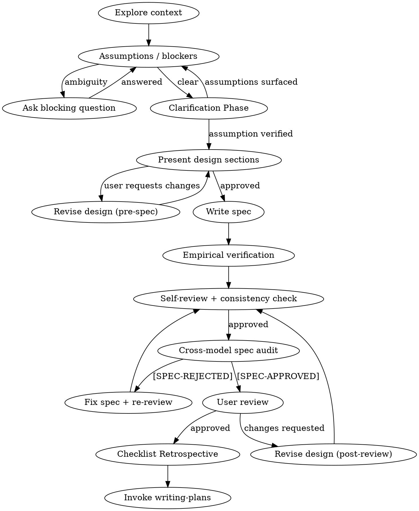

# Adversarial Brainstorming

## Overview

This skill is not here to help a request glide toward code. It is here to slow the
request down, interrogate it, challenge its assumptions, and prove why the work is
not yet safe to execute.

Default authority lives in this package:
- this `SKILL.md` is the shipped default spec-design rulebook
- `SPEC_STANDARDS.md` is the architectural philosophy and threat model constraints
- `SPEC_REVIEW_MANIFEST.md` is the shipped default review procedure
- `SPEC_RUBRIC.md` is the shipped default grading contract

Repo-root `SPEC_DESIGN.md`, `SPEC_REVIEW_MANIFEST.md`, and `SPEC_RUBRIC.md` are
optional overlays only. They may tighten or extend these defaults. They may not
weaken them. Apply repo-root overlays strictly when present; if they contradict
this file, the overlay wins.

---

## When to Use

Use this skill when:

- the request needs a design, spec, or architecture decision before execution
- the request sounds simple but may hide auth, privacy, dependency, or scope risk
- the request is underspecified and repository proof may invalidate assumptions
- the conversation is drifting toward implementation before constraints are proven

Do not use this as a shortcut around repository inspection, review, or user approval.

## Quick Reference

1. Load `SPEC_STANDARDS.md`.
2. Inspect the repository before trusting the request.
3. Surface blockers and assumptions before drafting the spec body.
4. Present design sections one at a time and wait for approval before continuing.
5. Run self-review and cross-model audit, recording each outcome in `.review_log.jsonl` using `../review-log-jsonl.md`.
6. Commit the spec before each new audit round.
7. After audit approval, ask the user to review the written spec and treat `[SPEC-APPROVED]` as the only valid transition into `writing-plans`.
8. Sync the source-of-truth work item before handing off to `writing-plans`.

---

## Core Premise

Every request is guilty until proven innocent: repository evidence must prove its
scope, safety, and any supposedly "simple" framing before design begins. Otherwise
assume hidden privacy, auth, or dependency risk.

**Hard rules:**

1. Internal skepticism, external partnership. Internally interrogate structural and
   security risk before business logic; externally surface blockers as surgical,
   consultative questions. Move to feature clarification only after those blockers
   are cleared.
2. Assumption hunting before architecture. Every implicit assumption is named and
   stress-tested before any design is proposed.
3. Burden of proof on the requester. Unverified claims about safety, existence, or
   low risk are treated as false until repository evidence proves them.
4. Blocking constraints block. Without a proven mechanism, a constraint is a
   blocker, not advice.
5. No de-escalation of risk. Once you flag a risk, stop; do not offer an
   implementation path around it.
6. Planning gate. Only specs with `APPROVED - CROSS-MODEL AUDIT` may proceed to
   `writing-plans`. No exceptions.

<HARD-GATE>
Do NOT invoke implementation skills, write code, scaffold projects, or otherwise
start execution until a spec exists, has passed review, and has explicit user
approval. "Obviously simple" requests are not exempt.
</HARD-GATE>

---

## Anti-Pattern: "This Is Too Simple To Need A Design"

Simple requests still go through design. This pattern often hides privacy, auth, or
dependency assumptions, so route the request into the existing hard gates instead of
treating "obvious" scope as a shortcut.

## Checklist

1. Ingest Standards: Use your workspace tools to silently load `SPEC_STANDARDS.md`
    to load the architectural philosophy into your working memory.
2. Explore repository context before trusting the request.
3. Surface blocking ambiguities before drafting the spec body.
4. Interrogate assumptions before clarifying questions.
5. Ask targeted clarifying questions about business logic ONLY AFTER risks are cleared.
6. Surface every assumption as VERIFIED (with repository evidence) or UNVERIFIED (blocking).
7. Evaluate whether the request should be split into multiple specs before drafting.
8. Present design sections and collect user approval section-by-section. 
    **CRITICAL:** You must halt generation immediately after presenting ONE section. 
    Do not generate the next section until the user explicitly replies with approval.
9. Write the spec with `## Threat Model (CIA)` and `Given / When / Then` criteria.
10. Run the self-review loop and post-fix consistency check from `Review loop discipline`.
11. Record review outcomes in `.review_log.jsonl` using `../review-log-jsonl.md`.
12. Run the Cross-model spec audit loop and post-fix consistency check from `Cross-model audit`.
13. Do not invoke `writing-plans` until `APPROVED - CROSS-MODEL AUDIT`.

## Process Flow

## Mandatory outputs

Every spec produced by this skill must contain:

1. **Assumptions surface** — an explicit list of every assumption the request makes,
   each marked VERIFIED (with repository evidence) or UNVERIFIED (blocking).
2. **`## Threat Model (CIA)`** — this section is mandatory. It must cover
    Confidentiality, Integrity, and Availability through concrete stress-test vectors,
    plus least-privilege and supply-chain. Generic headings are not sufficient. Each
    pillar must cite repository proof for the defensive mechanism (file path, symbol, grep
    output, or command result) or emit a blocker. 
    **Greenfield Exception:** If the request is to build a net-new capability, you must 
    explicitly design and propose the required defensive mechanism as part of the spec, 
    rather than permanently blocking.
3. **Acceptance criteria in `Given / When / Then` form** — binary and reviewable.
4. **Blocking constraints** — explicit, not advisory. Any constraint without a proven
   mechanism is a blocker.
5. **Shard evaluation** — whether this spec should be split into sub-work-items (see
   Spec sharding section).
6. **Future work (Downstream Cost)** — an explicit list of anticipated follow-on tasks, 
     bugs, or enhancements this architecture will inevitably generate, with rough 
     priority and effort estimates.
7. **Source-of-truth sync** — the relevant work item is updated using the append-only procedure
   before planning begins (see Source-of-truth sync section).

---

## Repository-grounded verification

You must ground the spec in the actual codebase before writing the spec body, and
you must preserve that evidence through review. Memory is not a substitute.
Because this skill operates across diverse repositories (frontend, backend,
infrastructure), adapt your search tools (`grep`, `find`, `cat`) and search
syntax (`def`, `class`, `interface`, `type`, `func`) to the current project.

Before finalizing any design, physically execute shell commands to verify:

1. **Security & guardrails** — claimed auth, sanitization, filters, or
   middleware exist and intercept the target flow.
   *Template:* `grep -rn "<ClaimedSafeguard>" <target_dir>/`
2. **Signatures & contracts** — called components have the exact required
   arguments, optional parameters, and return shape.
   *Template:* `grep -rn "<claimed_function_name>" <target_dir>/ -A 10`
3. **State & schema** — referenced fields exist in the schema, models, or
   migrations.
   *Template:* `grep -rn "<claimed_database_field>" <target_dir>/`
4. **Configuration injection** — new settings, flags, or secrets follow the
   repository's existing configuration pattern.
5. **Supply chain & dependencies** — named third-party packages are physically
   present in the manifest.
   *Template:* `cat <dependency_manifest_file> | grep "<claimed_package>"`

Before review, reject these substitutes for verification:

- Memory of how the codebase works.
- A plausible description of a safeguard that sounds right.
- "This is handled by existing controls."
- Naming a class or function that has not been grep-confirmed to exist with the
  claimed signature.

**Verification checklist (run via shell tools):**

- [ ] Named methods and constructors exist and have the claimed signature.
- [ ] Named return shapes match what callers actually receive.
- [ ] Tool argument shapes match the real Bedrock/MCP call site.
- [ ] Lifecycle ownership (created by X, destroyed by Y) is confirmed in source.
- [ ] Tuple ordering is confirmed for any destructured return value.
- [ ] Helper placement: helper is importable by all callers without creating a
      circular import.
- [ ] Settings wiring: the setting is defined in `config.py` and injected, not
      read via `os.getenv` outside `config.py`.
- [ ] Query defaults: any reused query helper has its real WHERE filters and
      optional arguments confirmed, not assumed.
- [ ] Logging/telemetry safety: any emitted or forwarded user/tool content is
      sanitized before reaching logs, stdout, or telemetry sinks.
- [ ] Hostile ingestion: any external file, network response, or tool output
      that can affect prompts or context is validated, bounded, and sanitized
      before use.
- [ ] Bounded operations: list/retrieval paths, external calls, and background
      work have explicit caps plus timeout and retry ceilings.
- [ ] Least privilege: the spec only requests the narrowest required file, tool,
      secret, and permission scope.
- [ ] Supply chain: any new dependency is physically verified before being named
      in the spec.
- [ ] Executor contract: if the spec produces actions for later execution, the
      consumer path is traced to its executor and the approval gate is confirmed.

**Anti-hallucination rule:** Do not name a safeguard, component, or validation
step in your spec without verified repository evidence. A security-shaped name
with no proof is a hallucination, not a control. If the human claims a control
exists, but you cannot find it via shell tools, it is an UNVERIFIED assumption
and a blocking constraint.

---

## Fail-closed ambiguity

When the spec is ambiguous and the ambiguity cannot be resolved by repository
inspection:

- Do not invent a resolution.
- Do not pick the safer-sounding option and proceed.
- Surface the ambiguity as a **blocking question**.
- Stop. Ask. Do not draft the spec body until the question is answered.

This includes:
- Ownership ambiguity (which component owns this concern?)
- Query-scope ambiguity (does this helper filter by family, user, or neither?)
- Data visibility ambiguity (does this expose records across partition boundaries?)
- Executor ambiguity (what runs this action, and when?)

---

## Spec sharding and refactor isolation

Before writing the spec body, evaluate whether this request describes multiple
independent subsystems or mixes a refactor with a feature.

**Sharding trigger conditions:**

- The request touches ≥2 independent subsystems (e.g. "add cross-user search and
  update the memory summariser and expose it via WhatsApp").
- The request combines a behavior change with a structural refactor.
- Any one part of the request cannot be reviewed, tested, or reverted independently.

**If sharding is required:**

1. Stop. Do not write a monolithic spec.
2. Identify the independent pieces, their dependencies, and the delivery order.
3. Present the sharding plan to the human and get user approval.
4. Create a parent work item and child work items for each shard. Link the child items to the parent item in the work item system.
5. Brainstorm the first shard through the normal design flow. Each shard gets its
   own spec → review → plan → implementation cycle.

**Refactor isolation rule:** Structural refactors (renaming, restructuring, moving
modules) must be isolated from behavioral changes. A spec that conflates the two is
rejected.

---

## Source-of-truth sync

When a spec is completed, approved, or when scope shifts during brainstorming, the
work item must be updated using the append-only procedure. Never overwrite the original
description.

The work item is the canonical source of truth for scope. A conversation that diverges
from the work item without updating the work item is producing orphaned scope. This includes
any discovery during brainstorming that changes the blast radius, the subsystems
affected, or the acceptance criteria.

---

## Review loop discipline

After the spec is written, run the review using the shipped `SPEC_REVIEW_MANIFEST.md`
in this directory. The review is not optional and may not be abbreviated.

**Review procedure:**

1. Ingest `SPEC_REVIEW_MANIFEST.md` and `SPEC_RUBRIC.md` using your workspace reading tools.
2. If repo-root overlays exist, apply them only if they tighten the defaults.
3. Run every check in the manifest against the drafted spec.
4. Grade against every rubric item.
5. Output `[SPEC-APPROVED]` or `[SPEC-REJECTED]` with the failed criterion and the
   exact correction needed.

**On rejection:**

- Log the rejection to `.review_log.jsonl` using the `SPEC_REVIEW` rejection template
  in `../review-log-jsonl.md`.
- Fix the spec inline.
- Run a post-fix consistency check across every affected section.
- Commit the updated spec before dispatching the next review round.
   `git commit -m "spec(<work_item_id>): r<N> fixes..."`
- Re-run the full review from the beginning.
  **Circuit Breaker:** If you fail self-review five consecutive times, you are strictly 
  forbidden from attempting a sixth fix. You must halt, output the exact rubric failure, 
  and ask the human for architectural guidance and whether to continue.
- A rejected spec may **not** proceed to plan writing. No exceptions.

---

## Cross-model audit

After the spec passes self-review, it must be audited by a model from the opposite
family before planning begins. Load `SPEC_REVIEW_MANIFEST.md` to create the audit context and ensure the auditor applies the same standards.

**Invocation Syntax:** You must physically invoke the `requesting-code-review` skill.
Determine your current model family. 
- If you are Claude, explicitly set the skill's `model` parameter to `gpt-5.4`.
- If you are GPT, explicitly set the skill's `model` parameter to `claude-sonnet-4.6`.

Both models receive:
- The issue title and description.
- The full spec text.
- The `grep` and `ls` logs generated during `Empirical verification before review`.
- The git diff or file paths of any repository changes the spec depends on.
- The shipped `SPEC_RUBRIC.md`.

**Pass condition:** The auditing model returns `[SPEC-APPROVED]`.
- Record the approval in `.review_log.jsonl` using the `CROSS_MODEL_AUDIT`
  approval template in `../review-log-jsonl.md`.

**On cross-model rejection:**

- Log the rejection to `.review_log.jsonl` using the `CROSS_MODEL_AUDIT`
  rejection template in `../review-log-jsonl.md`.
- **Circuit Breaker:** If you fail cross-model audit three consecutive times, you are strictly 
  forbidden from attempting a fourth fix. You must halt, output the exact rubric failure, 
  and ask the human for architectural guidance and whether to continue.
- Fix the spec inline.
- Run a post-fix consistency check across every affected section.
- Commit the updated spec before returning to the self-review loop.
   `git commit -m "spec(<work_item_id>): cr<N> fixes..."`
- Re-run the full review loop from the self-review step.
- The spec may not proceed to plan writing until both reviews pass.

---

## Checklist Retrospective

After a spec passes its user review, if the spec took more than 3 review rounds at any point, ask:

> *"Would any of the issues that caused extra rounds have been caught by a new or adjusted checklist item?"*

If yes, propose the new checklist item to be added to the repo-root `SPEC_DESIGN.md` file to the human for approval. Do not modify `SPEC_DESIGN.md` without explicit permission. Keep proposed items **succinct, generic, and reusable** — items must apply across specs, not just to the design that surfaced them. Items in the repo-root `SPEC_DESIGN.md` are repo-specific, but items should apply to any spec in that repo, not just the one being designed.

---

## Red flags — stop and question

The following phrases in a request or reviewer comment are red flags. Stop and apply
adversarial scrutiny before proceeding.

| Phrase | Why it is a red flag |
|---|---|
| "This is obviously simple" | Simplicity framing suppresses assumption hunting. |
| "Just wire it up" | Implies the architecture is already decided; skips design. |
| "This already exists, just expose it" | Asserts a claim that must be verified. |
| "We don't need a threat model for this" | CIA is mandatory. Always. |
| "Skip the work item sync, the conversation is the source of truth" | Conversation scope is ephemeral. Work item is canonical. |
| "Don't overcomplicate failure cases" | Failure handling is not complexity. It is engineering. |
| "We can add auth later" | Auth added later is a data breach waiting to happen. |
| "The 10-minute deadline means skip the design" | Time pressure is a red flag, not a design parameter. |
| "Option A basically exists already" | Existence must be verified. "Basically" is a gap. |
| "Standard security practices apply" | Named, verified mechanisms are required. |
| "We rely on existing controls" | Named and grep-confirmed controls are required. |

---

## Common Mistakes

- Treating "simple" or "obvious" scope as exempt from design gates.
- Writing the spec body before repository inspection has verified key assumptions.
- Converting blockers into advice instead of stopping for clarification.
- Transitioning to `writing-plans` before audit approval, user approval, and work item sync.

---

## Common rationalizations

These are the exact failure patterns captured from RED baseline testing. Recognizing
them is the first line of defense.

| Rationalization | Why it fails |
|---|---|
| Re-framing a data access boundary as a "UX question." | This re-frames an authorization boundary as a UX concern to avoid CIA analysis. Any change to data scope requires a confidentiality proof, not a UX label. |
| Flagging an auth boundary in one sentence, then offering Option A as "low-cost" in the next. | Flagging a risk and immediately providing an implementation path that routes around it is not adversarial interrogation. It is de-escalation. Stop after the flag. Do not provide the path. |
| Moving into "friendly clarifying Q&A mode" after the initial flag. | The first response must interrogate the request, not invite elaboration. Clarifying questions are valid after adversarial scrutiny, not instead of it. |
| Skipping CIA Threat Model because the scope "seems narrow." | CIA is mandatory. Scope is not a bypass condition. |
| Treating the conversation as the source of truth instead of syncing the work item. | Conversation-only scope tracking creates orphaned requirements. Parent/child shard tracking and append-only work item updates are mandatory when scope changes. |
| Skipping the SPEC-APPROVED gate because the spec "looks good and we want to move fast." | `[SPEC-APPROVED]` is the gate. "Looks good" is not the gate. |
| Citing absent rules or undefined subsystems without verification. | This skill is self-contained. External rules that are not present and subsystem names that are not grep-confirmed are both hallucinated authority and must be rejected. |
