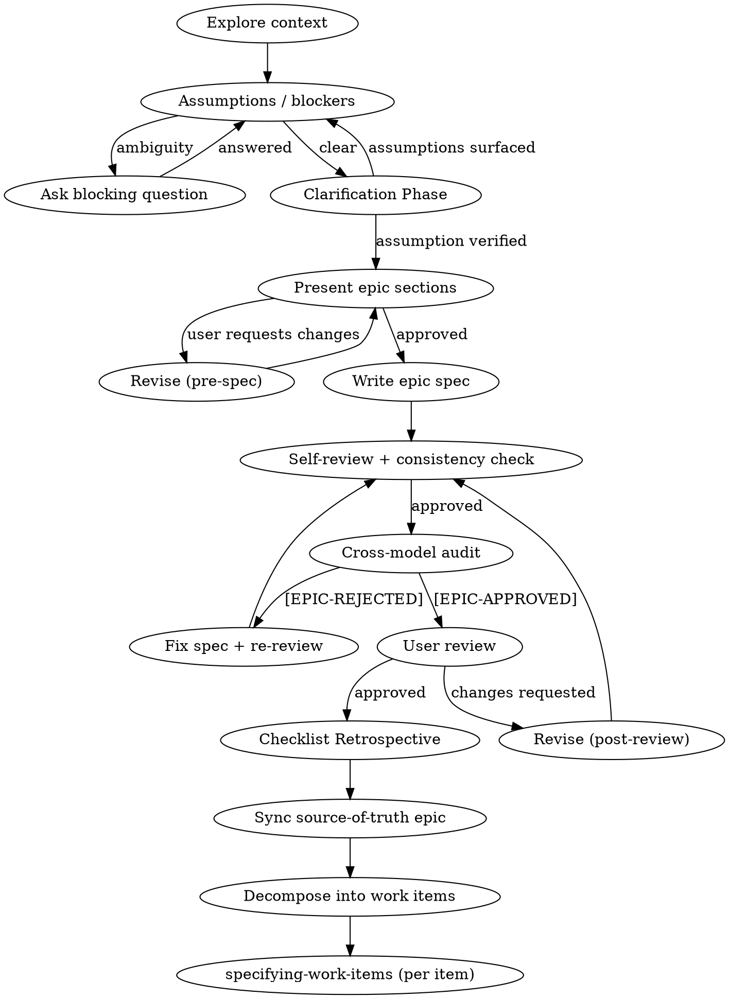

# Specifying Epics

## Overview

This skill surfaces the product problem space at the epic level before architecture begins.
It does not produce implementation decisions, threat models, or code references. It
produces a product artifact that a product manager, designer, or engineer can read to
understand exactly who is affected, what they need, what success looks like, and how the
epic decomposes into work items.

**Role:** You are a product-focused collaborator, not an interrogator. Your job is to get
what is stuck in the user's head onto the table — through conversation, not cross-examination.
Coach and draw out; interrogate assumptions only after the full picture is visible.

Default authority lives in this package:
- always load this `SKILL.md`
- load `EPIC_STANDARDS.md` when the request exposes scope, user-identity, business-rule,
  or CIA ambiguity
- load `review-workflow.md` only after a written epic spec exists

Repo-root `EPIC_DESIGN.md` is an optional overlay only. It may tighten or extend these
defaults. It may not weaken them. Apply repo-root overlays strictly when present; if they
contradict this file, the overlay wins.

---

## When to Use

Use this skill when:

- a feature request, initiative, or capability is too large or underspecified to go
  directly into `specifying-work-items`
- there is ambiguity about who benefits, what they need, or what success looks like
  at the feature level
- a piece of work needs product scope to be bounded and agreed before involving an architect
- the ask is at the epic or initiative level rather than at the individual work item level

After `[EPIC-APPROVED]`, decompose the epic into individual work items. Each work item
with meaningful technical complexity then proceeds through `specifying-work-items` for
architecture and design.

Do not use this skill to produce architecture decisions. It ends at the product boundary.

---

## Quick Reference

1. Load only the companion files needed for the current stage. Load `EPIC_STANDARDS.md`
   when the request exposes scope ambiguity, user-identity assumptions, conflicting
   business rules, or missing success criteria. Load `EPIC_REVIEW_MANIFEST.md` and
   `EPIC_RUBRIC.md` only after a written epic spec exists.
2. Surface blocking product ambiguities before drafting the epic body. Who are the users?
   What is the real problem? What does success look like?
3. If ambiguity is unresolved, output blocking questions only. Do not draft the epic spec
   while users, problems, or success criteria remain unverified.
4. Before the first approved section, output only `## Assumptions surface` or blockers,
   then stop. Do not emit downstream sections such as user stories, business rules, or
   acceptance criteria before the first approved section.
5. If a decision to build already exists before the problem is understood, stop. Do not
   retrofit a product rationale around a predetermined solution.
6. After a written epic spec exists, load `review-workflow.md`. Run self-review and
   opposite-family cross-model audit, record each outcome in `.review_log.jsonl` using
   `../shared/review-log-jsonl.md`, and treat `[EPIC-APPROVED]` as the only valid
   transition into work item decomposition and `specifying-work-items`.
7. Sync the source-of-truth epic before handing off.

---

## Discovery

Before any assumptions surface or blocking questions, invite the user to put the full
picture on the table. Open with space for a brain dump:

> *"Tell me about the epic — what's the idea, who it's for, and what you already have.
> Share any source material: memos, prior tickets, Slack threads, anything."*

Read what they provide first. Ask only what is missing. After the initial dump, a simple
*"anything else?"* often surfaces what they almost forgot. Drill into specifics only after
the broad shape is visible — premature granular questions interrupt the dump and miss
context.

**Calibrate rigour to stakes.** An internal tooling improvement does not need the same
depth as a public-facing product launch. Get a read on stakes early and let that shape how
hard you push.

**Don't do the thinking for them.** Echo back what you hear, name what is unclear, and
ask the question that forces them to think harder. The spec must feel like their creation,
not yours.

---

## Initial Gate

Before the epic body, return only `## Assumptions surface` plus blockers or blocking
questions.

Do not emit downstream sections such as user stories, business rules, acceptance
criteria, or work item breakdown before the first approved section.

## Core Premise

Every epic arrives carrying hidden assumptions about who the users are, what problem is
actually being solved, and what success looks like. Surface the full picture through
conversation first — then interrogate the assumptions that remain.

**Hard rules:**

1. Brain dump before interrogation. Get the full picture on the table before drilling into specifics.
2. User identity before scope. Know exactly who is affected before defining what changes.
3. Problem before solution. Every epic implies a solution. Surface the underlying problem first.
4. Assumption hunting before drafting. Every implicit assumption is named before the spec is written.
5. Scope is a constraint, not a target. The epic defines the minimum verifiable value, not everything that could be built.
6. Blocking constraints block. A business rule without a clear owner or verification path is a blocker, not advice.
7. Product gate. Only epic specs with `APPROVED - CROSS-MODEL AUDIT` may proceed to work item decomposition and `specifying-work-items`. No exceptions.

<HARD-GATE>
Do NOT decompose this epic into work items, invoke specifying-work-items, writing-plans,
or take any implementation action until the epic spec exists and has passed its audit gate
with [EPIC-APPROVED]. This applies regardless of perceived simplicity.
</HARD-GATE>

---

## Anti-Pattern: "This Is Too Simple To Need an Epic Spec"

Simple requests still need user identity, business rules, and acceptance criteria. "Simple"
scope hides the most dangerous assumptions and the most-missed edge cases. If the work is
genuinely a single work item with clear scope, proceed directly to `specifying-work-items`
instead. If the scope is uncertain, use this skill first.

---

## Checklist

1. Run `## Discovery` — invite the brain dump, read source material, calibrate to stakes.
2. Load `EPIC_STANDARDS.md` when scope, user-identity, business-rule, or CIA ambiguity is exposed.
3. Surface blocking product ambiguities. Ask only what is genuinely missing.
4. Surface every assumption as VERIFIED or UNVERIFIED (blocking).
5. Evaluate whether the epic should be split before drafting.
6. Present epic spec sections one at a time. **CRITICAL:** Halt after each section. Do not generate the next until the user explicitly approves.
7. Write the epic spec using `## Writing the Epic Body` and `## Deliverable Artifact`.
8. Load `review-workflow.md`, complete review and audit loop. Do not invoke work item decomposition until `APPROVED - CROSS-MODEL AUDIT`.

---

## Writing the Epic Body

The epic spec serves humans first. A product lead, designer, or engineer should be able
to scan the main body and understand who is affected, what they need, why it matters, the
governing business rules, and what success looks like — without reading any implementation
detail.

**Main-body rules:**

1. State business rules at product level. Not "the API will return X" but "a user may only
   have one active session." Not "the auth middleware rejects" but "a user without the
   required permission cannot access this feature."
2. Keep human-facing sections concise and non-repetitive. If the same fact appears twice,
   shorten the later mention or reference the earlier statement.
3. User stories state the user, the capability they want, and the benefit they get. No
   implementation detail. No references to APIs, services, or data structures.
4. Acceptance criteria are behavioral and user-perspective. They verify that the user gets
   what the user story promised. They do not assert implementation correctness.
5. Do not embed implementation assumptions. "The system validates the email address" is
   product-level. "The `validate_email()` function returns a 400" is not.
6. Name any business rule that constrains behavior. Name its owner: product, legal,
   operations, or compliance.

---

## Process Flow

---

## Deliverable Artifact and Workflow Obligations

Every epic spec workflow must establish the following before work item decomposition:

**Deliverable artifact must contain:**

1. **Problem statement** — who has this problem, what it is, why it matters, and why it is
   worth solving now. Include current state and its impact on affected users.
2. **User personas** — named user types with their jobs-to-be-done. Each persona must be
   specific enough to anchor user stories. "All users" is not a persona. For B2B products,
   distinguish *customer* (buyer/decision-maker) from *user* (operator/end-user) — they
   have different pain points and the epic may need to serve both.
3. **Value proposition** — the pain points addressed and the gains delivered, stated
   separately for customers and users where the distinction is meaningful.
4. **User stories** — in `As a [user], I want [capability], so that [benefit]` form. Each
   story names a real persona and a real job. No implementation detail.
5. **Business rules** — product-level constraints and behaviors. Named, unambiguous, and
   owned. No implementation mechanics.
6. **Assumptions surface** — every assumption the spec makes, each marked VERIFIED or
   UNVERIFIED (blocking).
7. **Constraints** — known hard limits on what the solution can be: regulatory
   obligations, contractual commitments, budget, existing platform boundaries. Constraints
   differ from assumptions: they are not things we believe — they are things we must
   respect. Contractually committed SLA/availability obligations belong here, not in NFRs.
8. **MoSCoW scope** — prioritisation across Must Have / Should Have / Could Have / Won't
   Have (this release). More useful than a flat out-of-scope list because it captures the
   negotiation surface explicitly.
9. **Dependencies** — teams, systems, or external parties this epic depends on to deliver,
   at product level. Not "we need endpoint X" but "this epic cannot ship until the billing
   team has completed their contract export work."
10. **Success metrics** — measurable outcomes confirming the epic delivered its intended
    user value. Split into:
    - *Leading indicators*: early signals of success (adoption rate, activation, engagement)
    - *Lagging indicators*: outcome confirmation (retention, revenue impact, support ticket reduction)
    - *MVP success criteria*: the minimum signal that proves the core hypothesis
11. **Risks** — business and market risks at product level, with product-level impact
    statements. Technical risks belong here only as product consequences ("billing runs fail
    during peak period causing regulatory breach"), not as architecture problems with
    technical mitigations.
12. **Future work (Downstream Product Cost)** — anticipated follow-on epics, user
    expectations this will create, and product debt this introduces.
13. **Proposed work item breakdown** — a suggested decomposition into individual work items,
    each small enough for one `specifying-work-items` session. Product-level decomposition;
    architecture will further refine it.
14. **Threat surface (CIA — product level)** — see `## Product-Level CIA Threat Surface`.

**Workflow must record / enforce:**

1. **Blocking constraints** — explicit, not advisory. Any business rule without a verified
   owner or an assumption without evidence is a blocker.
2. **Shard evaluation result** — whether this epic should itself be split into multiple
   epics.
3. **Decision log** — append-only record of significant product decisions made during
   specifying: scope boundaries chosen, personas included/excluded, metrics selected,
   alternatives rejected and why. This is the memory of the session for future epics that
   build on this one.
4. **Source-of-truth sync completion** — the epic work item is updated using the
   append-only procedure before work item decomposition begins.
5. **Review and audit gate completion** — self-review, cross-model audit, user approval,
   and required logging must all complete before handoff.

**This epic spec must NOT contain:**

- Implementation details, code references, or file paths
- Architecture decisions (those belong in `specifying-work-items`)
- Repository verification or code-level security patterns (those belong in
  `specifying-work-items`)
- Performance, deployment, or infrastructure constraints (those belong in
  `specifying-work-items`)

If a section can be deleted without changing what a product manager or designer needs to
understand, it does not belong in the epic body.

---

## Product-Level CIA Threat Surface

This section is mandatory in every epic spec. Its purpose is to surface confidentiality,
integrity, and availability concerns at the product and business level — before
architecture is chosen. The mechanisms that address these concerns belong in
`specifying-work-items`, not here.

**The question at each pillar is not "how will we protect this?" — it is "what is the
risk and who does it affect?"**

Load `EPIC_STANDARDS.md` for the full framing of what belongs at epic vs. work-item level
for each pillar.

| Epic level (here) | Work item level (`specifying-work-items`) |
|---|---|
| Who can see this data? What categories? | Which auth mechanism enforces this? (grep-confirmed) |
| What happens if this input is wrong or corrupted? | What sanitisation and validation intercept it? |
| Who is affected if this capability is unavailable? | What retry, timeout, and fallback patterns apply? |
| What regulatory or contractual constraints apply? | How are those constraints implemented and tested? |

State findings as product rules, not implementation decisions. Each pillar must be
explicitly addressed — "security is an engineering concern" is not an acceptable answer.
If this epic introduces a net-new capability with no prior constraints, state that
explicitly; its absence is itself a product decision.

---

## Epic Sharding

Before writing the epic body, evaluate whether this request describes multiple independent
value streams or mixes a policy change with a new capability.

**Sharding trigger conditions:**

- The epic delivers value to ≥2 independent user groups with different success metrics.
- The epic combines a product policy change with a net-new capability.
- Any one part of the epic cannot be shipped, measured, or reverted independently.
- The proposed work item breakdown exceeds what a single team can reasonably own.

**If sharding is required:**

1. Stop. Do not write a monolithic epic spec.
2. Identify the independent pieces and their dependency order.
3. Present the sharding plan to the human and get user approval.
4. Create a parent epic and child epics. Link them in the work item system.
5. Spec the first child epic through the normal product flow.

---

## Source-of-Truth Sync

When an epic spec is completed, approved, or when scope shifts during specifying, the epic
work item must be updated using the append-only procedure. Never overwrite the original
description.

The epic work item is the canonical source of truth for scope. A conversation that diverges
from the epic without updating it is producing orphaned scope.

---

## Review and Audit Gate

Load `review-workflow.md` after a written epic spec exists. Do not load review or audit
companions for first-turn gate decisions.

An epic spec may not proceed to work item decomposition or `specifying-work-items` until:
- self-review passes
- opposite-family cross-model audit returns `APPROVED - CROSS-MODEL AUDIT`
- user approves the written spec with `[EPIC-APPROVED]`
- source-of-truth sync is complete

---

## Handoff

After `[EPIC-APPROVED]` and source-of-truth sync, decompose the epic into individual work
items using the proposed breakdown as a starting point. For each work item:

- If the work item has meaningful technical complexity (auth, data models, integrations,
  security surface, or novel architecture), invoke `specifying-work-items`.
- If the work item is straightforward with no meaningful technical design needed, proceed
  directly to `writing-plans`.

Do not make the complexity judgment unilaterally. Discuss it with the user.

---

## Checklist Retrospective

After an epic spec passes user review, if it took more than 3 review rounds at any point,
ask:

> *"Would any of the issues that caused extra rounds have been caught by a new or adjusted
> checklist item?"*

If yes, propose the new checklist item to the repo-root `EPIC_DESIGN.md` for user
approval. Do not modify it without explicit permission. Keep items succinct, generic, and
reusable — they must apply across epics, not just to the one that surfaced them.

---

## Red Flags — Stop and Question

| Phrase | Why it is a red flag |
|---|---|
| "The users are just… everyone" | Vague user identity suppresses assumption hunting. Name a real user with a real job. |
| "This is obviously what they want" | Unstated user research is an unverified assumption. |
| "We don't need success metrics for this" | Without metrics, you cannot know whether the epic worked. |
| "Just add it to the existing epic" | Scope additions without separate evaluation hide shard triggers. |
| "The engineering team will figure out the edge cases" | Product edge cases are product rules. They belong in the epic spec. |
| "We know what success looks like" | If it cannot be stated, it cannot be verified. |
| "This is too small to need an epic" | If the scope is unclear, the tool is correct. If scope is clear, use specifying-work-items directly. |
| "The acceptance criteria are obvious" | Obvious criteria are the ones that have never been written down. Write them. |
| "We don't need a threat model for this" | CIA at product level is mandatory. Scope is not a bypass condition. Mechanism is left to architecture; the concern and its business rules are not. |
| "Security is an engineering concern" | Data sensitivity, permitted access, and acceptable degradation are product decisions. Architecture cannot make them silently on your behalf. |
| "We'll sort out the work item breakdown in the sprint" | Decomposition is a product decision. Leaving it to sprint planning hides scope risk. |
| "Let's add a technical approach section" | Technical direction belongs in specifying-work-items, not in the product spec. |
| "The NFRs are: API response < 200ms, 99.999% uptime" | Specific engineering targets are architecture decisions. The product-level statement is the contractual or user-experience obligation — e.g. "SLA requires 99.9% availability" or "users must not experience perceptible lag during checkout". Engineering targets come later. |

---

## Common Mistakes

- Treating acceptance criteria as the first complete definition of business rules. Rules
  go in the main body first; criteria verify them.
- Writing implementation-shaped acceptance criteria ("the system returns 200") instead of
  user-behavioral criteria ("the user sees their updated balance").
- Absorbing scope additions silently instead of evaluating them as potential shard
  triggers.
- Moving to architecture before product ambiguities are resolved.
- Stating success metrics as features ("users can export data") rather than outcomes
  ("export adoption reaches X% within 30 days of launch").
- Producing a work item breakdown that is really a technical task list rather than a
  product decomposition.

---

## Common Rationalizations

| Rationalization | Why it fails |
|---|---|
| "The users are developers, so we don't need personas." | Developers have jobs-to-be-done. "Developer" is not a user story. |
| "We'll define success in the retro." | Post-hoc success criteria cannot gate go/no-go decisions. |
| "The business rules are obvious from context." | Obvious rules are the ones most often violated in implementation. Write them. |
| "We can sort out product edge cases in specifying-work-items." | Architecture cannot invent product rules. Product rules must exist before architecture begins. |
| "[EPIC-APPROVED] is just a formality here." | The gate exists precisely because every spec looks complete to the person who wrote it. |
| "The work item breakdown is an engineering decision." | Decomposition determines what gets built first and what gets cut. That is a product decision. |
